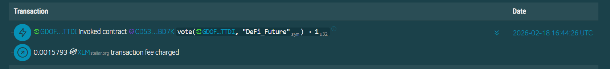
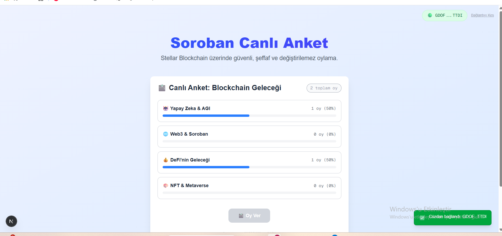

# Soroban Live Poll (CanlıAnket-Wallet)

A decentralized voting application built on the **Stellar Blockchain** using **Soroban** smart contracts. This project allows users to participate in live polls securely and transparently using their Stellar wallets.

## 📸 Screenshots

| Poll Interface | Transaction Confirmation |
|:---:|:---:|
|  |  |

> *Note: Please place your screenshots in an `assets` folder in the root directory and name them `screenshot1.png` and `screenshot2.png`.*

## 🚀 Features

- **Decentralized Voting:** All votes are recorded on the Stellar blockchain via Soroban contracts.
- **Wallet Integration:** Seamless connection with **Freighter Wallet**.
- **Real-time Updates:** View live poll results immediately.
- **Transparent:** Verifiable transaction history on the blockchain.

## 🛠️ Technology Stack

- **Frontend:**
  - [Next.js](https://nextjs.org/) (React Framework)
  - [TypeScript](https://www.typescriptlang.org/)
  - [Tailwind CSS](https://tailwindcss.com/)
  - [Stellar SDK](https://developers.stellar.org/docs/tools/sdks/library)
  - [Stellar Wallets Kit](https://github.com/Creit-Tech/Stellar-Wallets-Kit)

- **Blockchain:**
  - **Soroban:** Smart Contracts (Rust)
  - **Network:** Stellar Testnet

## 📂 Project Structure

```
CanlıAnket-Wallet/
├── contracts/          # Soroban smart contracts (Rust)
├── frontend/           # Next.js frontend application
├── assets/             # Project images and screenshots
└── README.md           # Project documentation
```

## 🏁 Getting Started

Follow these instructions to set up the project locally.

### Prerequisites

Ensure you have the following installed:

- [Node.js](https://nodejs.org/) (v18 or higher)
- [npm](https://www.npmjs.com/)
- [Freighter Wallet Extension](https://www.freighter.app/)

### Installation

1.  **Clone the repository:**

    ```bash
    git clone https://github.com/yourusername/CanliAnket-Wallet.git
    cd CanliAnket-Wallet
    ```

2.  **Navigate to the frontend directory:**

    ```bash
    cd frontend
    ```

3.  **Install dependencies:**

    ```bash
    npm install
    ```

4.  **Run the development server:**

    ```bash
    npm run dev
    ```

5.  **Open the application:**

    Open [http://localhost:3000](http://localhost:3000) with your browser to see the result.

## 🗳️ Usage

1.  **Connect Wallet:** Click the "Connect Wallet" button in the top right corner and approve the connection in Freighter.
2.  **Vote:** Select an option from the active poll and click "Vote".
3.  **Confirm:** Sign the transaction in your Freighter wallet.
4.  **View Results:** Watch the vote count update in real-time!

## 📜 License

This project is licensed under the MIT License.
